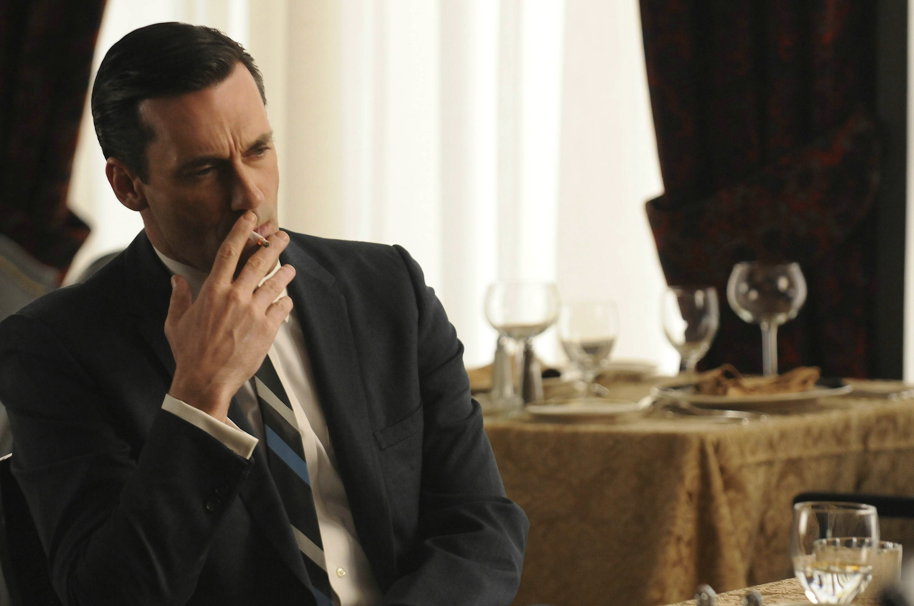
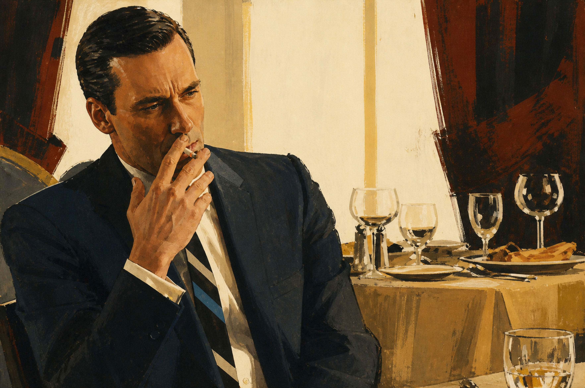
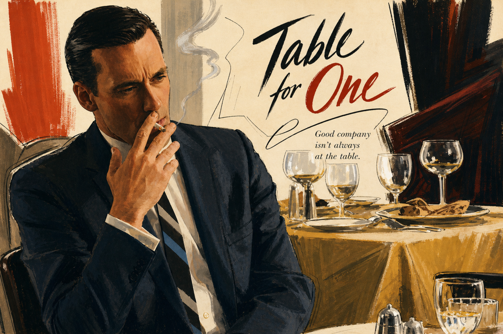
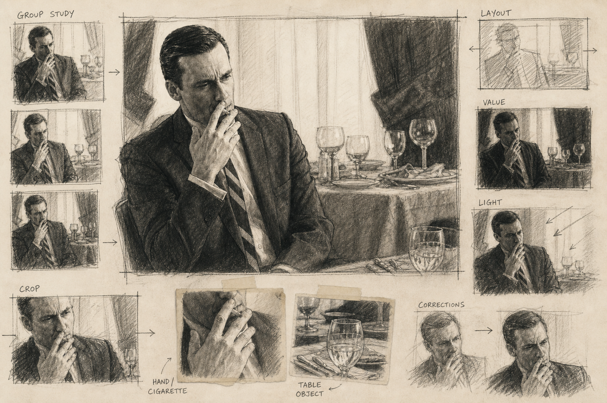

# Mad Men Advertising Skill

最近在重看美剧《Mad Men》时，我经常被剧中 Don Draper 和团队向客户展示广告方案的场景吸引。无论是墙上的广告海报，还是提案过程中随手绘制的构图草图，都带有一种鲜明的 20 世纪中叶美国商业插画气质。

出于对这种视觉风格的兴趣，我进一步查阅了那个年代具有代表性的商业插画作品和插画师，并最终确定了本 Skill 的三种创作方向。

这个 Skill 就是从这段观看体验和后续的视觉研究中发展而来的：尝试将《Mad Men》中的广告创意流程，以及那个时代的商业插画美学，转化为一套可以实际使用的图像生成工作流。

将用户上传的人物、产品、宠物、食物或建筑图片，转化为三种不同角色的 20 世纪中叶美国商业插画。

上传图像负责提供主体身份、数量、姿势和关键关系；skill 负责重构画面的媒介、构图、色彩、文字与完成度。

## 三种模式

| 模式 | 作用 | 默认文字规则 |
| --- | --- | --- |
| **Premium Commercial Illustration / 精致商业插画** | Bernie Fuchs 方向的完成商业插画：印刷色场、选择性细节和完整场景叙事。 | 无文字 |
| **Editorial Commercial Illustration / 编辑式商业插画** | Al Parker 方向的杂志图文页：人物、道具、留白和手绘英文文字共同组织阅读路线。 | 带标题、辅助句和多条正向短描述 |
| **Advertising Agency Concept Board / 广告公司提案稿** | Austin Briggs 方向的步骤式黑白插画提案板：以主构图为中心，展示 Group Study、Layout、Value、Light 等构图推敲步骤。 | 仅允许简短的功能性手写标签 |

## 使用边界

- 上传图用于锁定主体事实，而不是复刻原图的镜头和风格；
- 保持人物、动物、产品或建筑的身份、数量、姿势、关键物体和关系；
- 不自动新增人物、动物、角色、品牌或无依据主张；
- 每次只生成一种模式；三种模式固定，不混合，也不扩展第四种；
- 输出画面默认使用与用户上传图片完全相同的宽度和高度，画面内容本身填满画布并保持原始方向；不在画面外加留白、边框或补色背景来凑尺寸。若工具不支持自定义像素尺寸，则在目标画幅内重新构图或安全裁切，不拉伸、不用外扩背景伪造尺寸；
- 成图必须是重新组织的商业插画或步骤式手绘开发稿，而不是复古滤镜。

## 使用

在支持 Codex skills 的环境中加载本项目根目录的 [`SKILL.md`](SKILL.md)，上传一张图片后指定模式即可。

```text
使用 Mad Men Advertising Skill。
把我上传的图片转换为 Editorial Commercial Illustration / 编辑式商业插画。
```

未指定模式时，默认生成 Premium Commercial Illustration。

## 展示案例

同一张餐厅人物原图分别转换为三种模式。四张案例图使用相同的 `3530 × 2344` 像素画布，便于直接比较；Agency 案例进一步展示从 Group Study、Layout、Value、Light 到主构图的步骤式推敲过程。

阅读这组案例时，应同时看三件事：三张输出是否仍保留同一主体与关键动作；四张图是否保持相同画布尺寸；去掉文件名后，是否还能明显区分为完成商业插画、杂志图文页与步骤式黑白开发提案板。

### 原图



### Premium Commercial Illustration / 精致商业插画



### Editorial Commercial Illustration / 编辑式商业插画



### Advertising Agency Concept Board / 广告公司提案稿



## 工程结构

```text
Mad-Men-Advertising-Skill/
├── SKILL.md                                      # 唯一运行入口：三种模式和所有生成约束
├── README.md                                     # 项目说明、使用方式与展示案例
├── .gitignore                                    # 本机、IDE 与生成产物忽略规则
├── examples/                                     # 可直接查看的生成效果示例
│   └── restaurant-smoker/                        # 同一原图的三模式展示案例
│       ├── original-reference.png                # 原始人物照片
│       ├── premium-commercial-illustration-v2.png   # 精致商业插画输出
│       ├── editorial-commercial-illustration-v2.png # 编辑式商业插画输出
│       └── advertising-agency-concept-board-v2.png  # 广告公司提案稿输出
├── references/
│   └── sources.md                                # 研究出处索引；不参与运行
└── tests/
    └── evaluation.md                             # 主体保真与三模式验收标准
```
