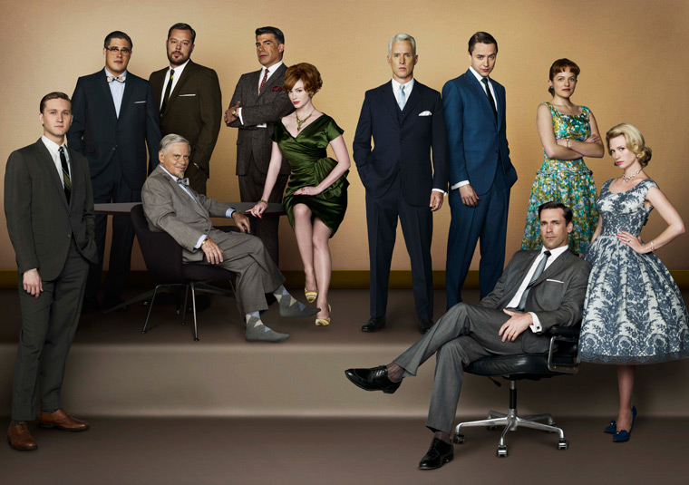
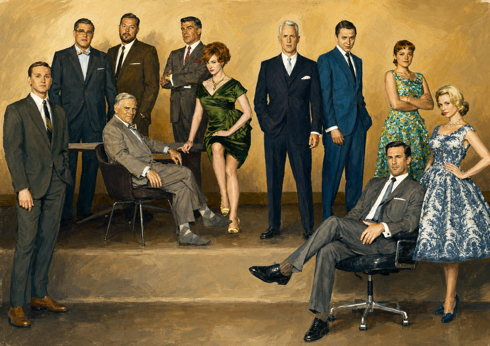
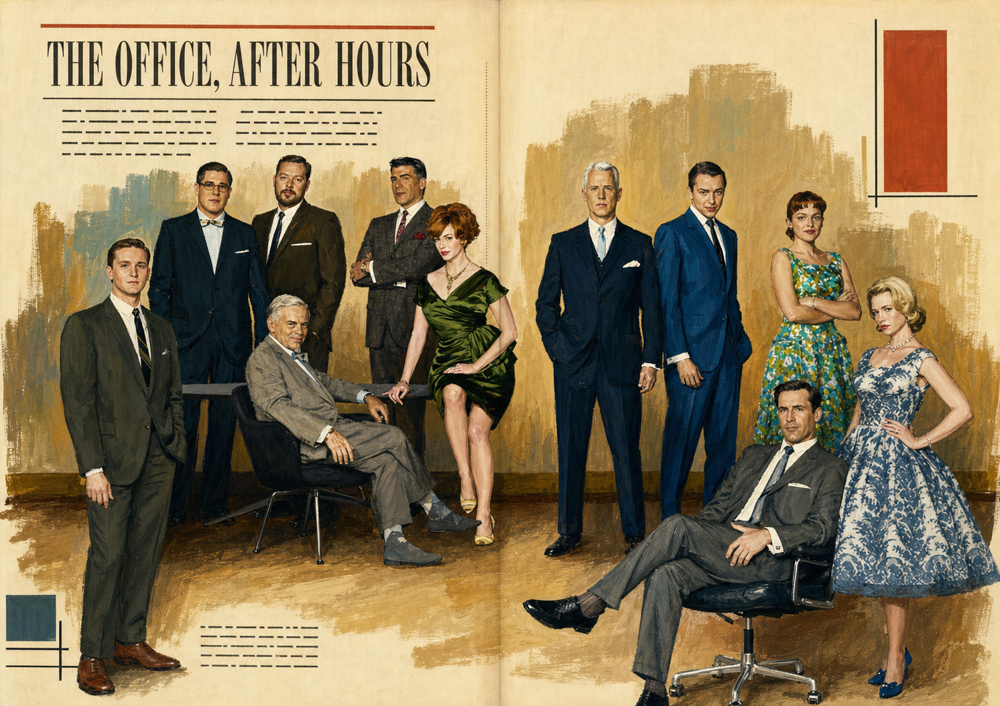
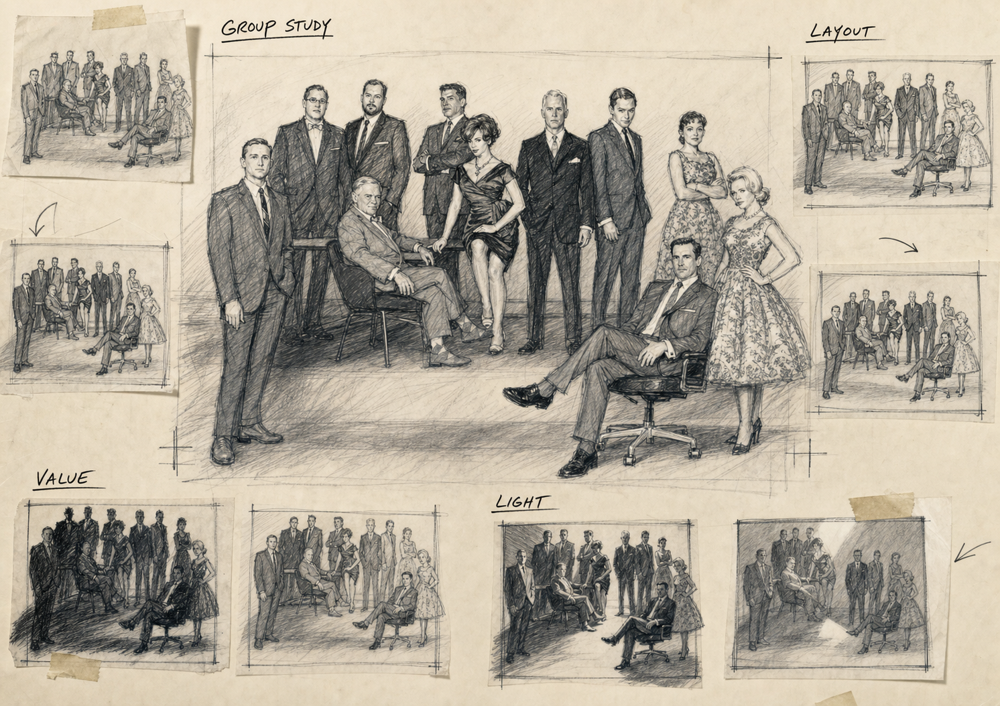

# Mad Men Advertising Skill

> Draft / Work in progress — no formal release has been published.

A visual-direction skill for transforming user-supplied people, pets, architecture, food, and products into 1950s–1960s Madison Avenue commercial art while preserving the original subject.

## Core principles

- Preserve the exact subject, identity, pose, structure, and subject count.
- Treat the uploaded image as a subject reference, not a style reference.
- Use hand-painted mid-century advertising language rather than a modern AI look or a simple vintage filter.
- Never add people, animals, or characters unless the user explicitly requests them.
- Use one output mode per request by default.

## Three modes

1. **Premium Commercial Illustration** — 精致商业插画；finished advertising artwork with no typography.
2. **Editorial Commercial Illustration** — 编辑式商业插画；a magazine-style story told through setting, props, light, and composition.
3. **Advertising Agency Concept Board** — 广告公司提案板；a black-and-white, hand-drawn internal creative-development presentation with rough sketches, construction lines, studies, and concise notes. Color appears only when explicitly requested.

These names and roles are fixed. The Skill does not include Advertising Photography or a fourth mode.

## Curated style references

The reference index includes museum and archive material for the visual foundation and each mode:

- David Klein — bold Jet Age commercial composition
- Stan Galli — direct, resolved premium commercial illustration
- Mac Conner — hand-painted advertising and editorial storytelling
- George Lois archive — concept-first agency development

See [`references/style-cases.md`](references/style-cases.md). These are learning references, not assets to copy.

They are not generated validation cases. The eleven-person people ensemble below is the only retained generated showcase case.

## Showcase case

### Case 01 — People Ensemble / Three Fixed Modes

#### Original reference



#### Premium Commercial Illustration



#### Editorial Commercial Illustration



#### Advertising Agency Concept Board



This single case preserves all eleven people and their group arrangement across the three fixed modes. It provides a direct comparison between the original reference, a finished typography-free premium illustration, an editorial magazine treatment, and a monochrome hand-drawn agency concept board. Case 01 is the sole generated showcase case retained for this beta draft.

## Use the skill

Give an Agent the raw Skill URL and ask it to load the instructions:

```text
https://raw.githubusercontent.com/Lexieyuu/Mad-Men-Advertising-Skill/main/SKILL.md
```

Example request:

```text
Load this skill, then transform my uploaded image into a Mad Men-era premium commercial illustration.
```

If no mode is specified, the skill defaults to **Premium Commercial Illustration**.

## Repository structure

```text
Mad-Men-Advertising-Skill/
├── SKILL.md
├── prompts/
│   ├── premium.md
│   ├── editorial.md
│   └── agency.md
├── references/
│   ├── mad-men-visual.md
│   └── style-cases.md
├── examples/
│   ├── subject-directions.md
│   ├── person.md
│   ├── pet.md
│   ├── architecture.md
│   └── people/
│       ├── case-01-people-ensemble-original.jpeg
│       ├── case-01-people-ensemble-premium.png
│       ├── case-01-people-ensemble-editorial.png
│       └── case-01-people-ensemble-agency-concept.png
└── tests/
    └── evaluation.md
```

## Status

This repository is an early draft in the `v0.1.0-beta` limited-validation phase. Subject preservation runs as a required preflight before visual transformation, and creative additions cannot change locked subjects, objects, or relationships.

The eleven-person people ensemble is the sole retained generated showcase case, documented with its original reference and one output for each of the three fixed modes. Person, pet, architecture, product, and food documents describe supported directions, but those categories have not been validated through additional cases. No further generated cases are planned for this beta draft.

This limited evidence supports an experimental beta, not a claim of stable performance across every subject category. There are currently no tags or published releases.
